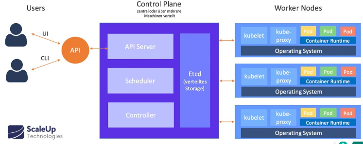

# 01 - Architecture

Reference: https://spacelift.io/blog/kubernetes-architecture

Dropbox document: https://www.dropbox.com/home/Studio%20dbi/Kubernetes?preview=Kubernetes+architecture.docx

https://devopscube.com/kubernetes-architecture-explained/

## Introduction

**Kubernetes** is an open-source, platform orchestrating containerized applications, implementing functions load
management, networking,
security, storage abstractions, scaling functionalities in a self-managed, multi node production environment.

Kubernetes distributed system follows a client-server architecture with two main components:
the **Control Plane** and **Worker Nodes**.

The Kb8 architecture is spread over multiple nodes where one of them is elected as **master node**
running the **Control Pane**, managing all the nodes in the cluster.

**Worker Nodes** are the machines where the actual application workloads (packaged as pods) run.
Each worker node contains essential components such as `kubelet` (to communicate with the Control Plane),
a **container runtime** (e.g., Docker or containerd), and the **kube-proxy** (to manage networking and load balancing).

The **control plane** is the central management entity of the Kubernetes cluster, responsible for maintaining the
desired state of the cluster. It consists of:

* **API Server**: Acts as the interface for managing the cluster and communicates with all components.
* **Scheduler**: Assigns pods to nodes based on resource availability and policies.
* **Controller Manager**: Handles background tasks such as maintaining node health, scaling, and other cluster-wide
  operations.
* **etcd**: A key-value store that stores all cluster data, including configuration and state.

In addition to the core components, Kubernetes clusters often include add-ons to extend functionality. These could be,
for example:

* Networking solutions (e.g., Calico, Cilium)
* Monitoring tools (e.g., Prometheus, Grafana)
* Ingress controllers (e.g., NGINX Ingress Controller)
* Storage solutions (e.g., Ceph, Longhorn)

### Control vs Data planes

|             | Control Pane                              | Data Pane                                    |
|-------------|-------------------------------------------|----------------------------------------------|
| Purpose     | Manages and orchestrates the cluster.     | Executes workloads and provides networking.  |
| Location    | Runs on dedicated master nodes.           | Runs on worker nodes.                        |
| Components  | API Server, Scheduler, Controllers, etcd  | Kubelet, Kube-Proxy, Container Runtime, Pods |
| Interaction | Interfaces with administrators and users. | Interfaces with workloads and control plane. |

TBC: https://spacelift.io/blog/kubernetes-architecture

Ask questions to Gemini
