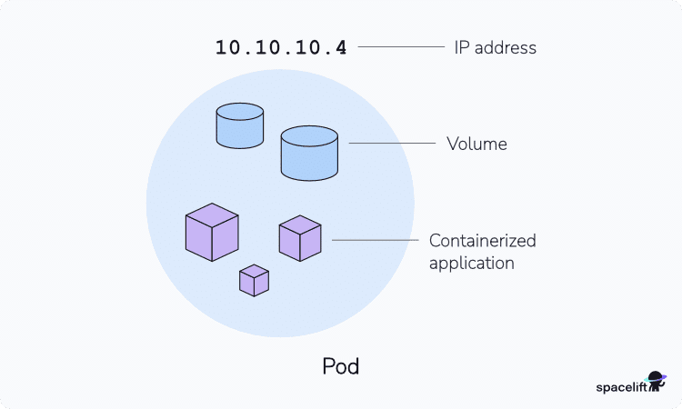
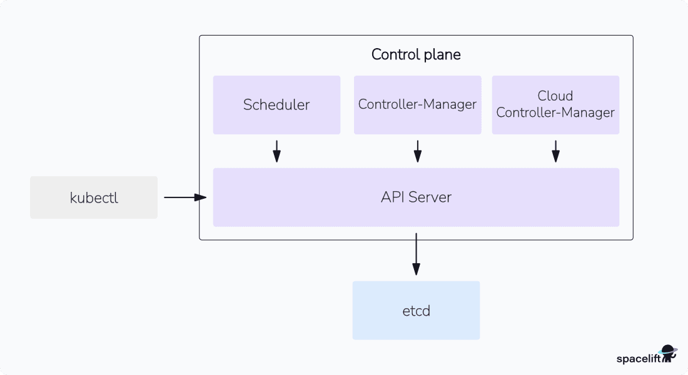
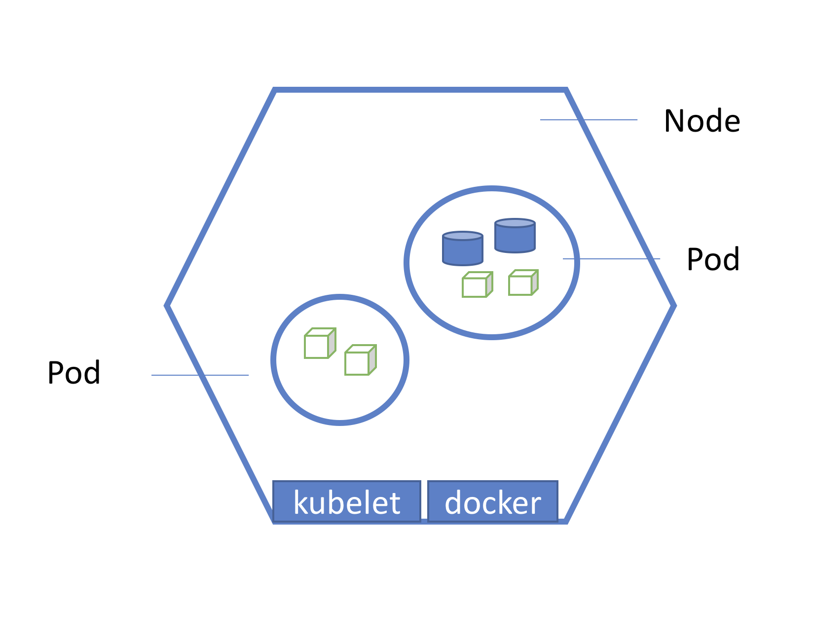

# 02 - Kubernetes main components

Reference: https://spacelift.io/blog/kubernetes-architecture

Dropbox document: https://www.dropbox.com/home/Studio%20dbi/Kubernetes?preview=Kubernetes+architecture.docx

https://devopscube.com/kubernetes-architecture-explained/

## Workloads

### POD



**Pods** are the fundamental compute unit in Kubernetes. 
A Pod is a **group of one or more containers that share the same specification, sharing the same environment** (storage, network infra etc...)

The containers in a Pod share **an IP Address and port space**, are always co-located and co-scheduled,
and run in a shared context on the same Node.

### Deployment

A Deployment wraps the lower-level ReplicaSet object. 
It guarantees a certain number of replicas of a Pod will be running in your cluster. 
Deployments also provide declarative updates for Pods; you describe the desired state, and the Deployment will automatically add, replace, and remove Pods to achieve it.

### Service

Services expose Pods as a network service. You use services to permit access to Pods, either within your cluster via automatic service discovery, or externally through an Ingress. (Read more: What is a Kubernetes Service?)
For more details look into the Kubernetes networking section

### Job

A Job starts one or more Pods and waits for them to successfully terminate. 
Kubernetes also provides CronJobs to automatically create Jobs on a recurring schedule.

### DaemonSets and StatefulSets

DaemonSets replicate a Pod to every Node in your cluster, while StatefulSets provide persistent replica identities.

See [StatefulSet vs. Deployment](https://spacelift.io/blog/statefulset-vs-deployment).

## Control plane components

The control plane is a collective term for many different components. 
Together, they provide everything needed to administer your cluster but not actually start and run containers.



### API Server `kube-apiserver`
The API server is the control plane component that **exposes the Kubernetes REST API**. 
You’re using this API whenever you run a command with Kubectl or use a GUI to manage the cluster. 
You’ll lose management access to your cluster when the API server fails, but your workloads won’t necessarily be affected.

### Controller Manager (`kube-controller-manager`)
Much of Kubernetes is built upon the _controller pattern_, an infinite loop of a sequence of _WATCH_, _ANALYZE_, _ACT_ actions.
A controller is a loop that continually monitors your cluster and performs actions when certain events occur.
Many customized controllers can be added to the cluster (sealed secrets is an example)


The **controller manager oversees all the controllers in your cluster**. 
It starts their processes and ensures they’re operational the whole time that your cluster’s running.

#### Controller types

* _Node Controller_: Manages the worker nodes in your cluster, ensuring they are **healthy and available** to run your applications. 
* _Replication Controller_: Ensures that a specified **number of replicas of your pods** are running at all times, providing high availability and fault tolerance. 
* _Deployment Controller_: Manages the deployment of your applications, **allowing you to perform rolling updates and rollbacks with ease**. 
* _StatefulSet Controller_: Manages stateful applications that require persistent storage and stable network identities, such as databases. 
* _DaemonSet Controller_: Ensures that a copy of a pod runs on each node in your cluster, typically used for running daemons or agents. 
* _Job Controller_: Manages batch jobs that run to completion, such as data processing tasks. 
* _CronJob Controller_: Manages scheduled jobs that run at specific intervals, such as backups or reports.

### Etcd


`etcd` is an open-source strongly consistent, distributed **key-value store**.

* **Strongly consistent**: If an update is made to a node, strong consistency will ensure it gets updated to all the other nodes in the cluster immediately.
* **Distributed**: etcd is designed to run on multiple nodes as a cluster without sacrificing consistency.
* **Key Value Store**: A nonrelational database that stores data as keys and values. It also exposes a key-value API.

It acts as both a **backend service discovery** and a **database**.

etcd uses [raft consensus algorithm](https://raft.github.io/) for strong consistency and availability.
For more details look here [Appendix B - How Raft works.md](Appendix%20B%20-%20How%20Raft%20works.md)
It works in a leader-member fashion for high availability and to withstand node failures.

So how does etcd work with Kubernetes?

To put it simply, when you use kubectl to get kubernetes object details, you are getting it from etcd. Also, when you deploy an object like a pod, an entry gets created in etcd.

In a nutshell, here is what you need to know about etcd.

* `etcd` stores all configurations, states, and metadata of Kubernetes objects (pods, secrets, daemonsets, deployments, configmaps, statefulsets, etc).
* `etcd` allows a client to subscribe to events using `Watch()` API . Kubernetes api-server uses the etcd’s watch functionality to track the change in the state of an object.
* `etcd` exposes key-value API using `gRPC`. Also, the gRPC gateway is a RESTful proxy that translates all the HTTP API calls into gRPC messages. This makes it an ideal database for Kubernetes.
* `etcd` stores all objects under the /registry directory key in key-value format. For example, information on a pod named Nginx in the default namespace can be found under /registry/pods/default/nginx

Also, etcd it is the only **Statefulset component** in the control plane.

The number of nodes in an etcd cluster directly affects its fault tolerance. Here’s how it breaks down:

* 3 nodes: Can tolerate 1 node failure (quorum = 2)
* 5 nodes: Can tolerate 2 node failures (quorum = 3)
* 7 nodes: Can tolerate 3 node failures (quorum = 4)
And so on. The general formula for the number of node failures a cluster can tolerate is:

```
fault tolerance = (n - 1) / 2
```

Where n is the total number of nodes.

### Scheduler (`kube-scheduler`)
The **scheduler is responsible for placing newly created Pods onto the Worker Nodes in your cluster**.

The scheduling process works by first **filtering out Nodes** that can’t host the Pod, and then **scoring each eligible Node** to identify the most suitable placement.


#### Scheduler filtering and scoring

When the POD requests is submitted from external services to the API Server (1), 
the latter updates the specs in the `etcd` db with the desired state (2).
(3) The scheduled status is notified to the external system. The scheduler detects the status change
via the `Watch()` on the etcd db (4), updates the pod status (5).


(6) During the **filtering** phase, the scheduler selects a percentage of the cluster nodes (equals to `percentageOfNodesToScore`) 
with the available resources for the pod, dialing with the nodes `kubelet` (7).
The filtered nodes are applied to the **scoring** phase (based on multiple parameters of the https://kubernetes.io/docs/reference/scheduling/config/#scheduling-plugins)   
Starting from the highest ranked node, the scheduler tries to create a **pod bound to a node** (8-9), going through the 
ranked list if the bound fails. The scheduler then updates the status on the `etcd` db (10).

### Cloud Controller Manager
The Cloud Controller Manager integrates Kubernetes with your cloud provider’s platform. 
It **facilitates interactions between your cluster and its outside environment**. 
This component is involved whenever Kubernetes objects change your cloud account, such as by provisioning a load balancer, adding a block storage volume, or creating a virtual machine to act as a Node.

## Node components

Nodes are the **physical or virtual machines that host the Pods in your cluster**. 
Although it’s possible to run a cluster with a single Node, production environments should include several so you can horizontally scale your resources and achieve high availability.

Nodes **join the cluster using a token issued by the control plane**. 
Once a Node is admitted, the control plane starts scheduling new Pods for it. 
Each Node runs several software components to start containers and maintain communication with the control plane.

The diagram below shows the architecture of a node:



### Kubelet
Kubelet is the Node-level process that acts as **the control plane’s agent**. 
It periodically checks in with the control plane to **report the state of the Node’s workloads**. 
The **control plane can contact Kubelet when it wants to schedule a new Pod** on the Node.

`Kubelet` is also responsible for **running Pod containers**. 
It pulls the images required by newly scheduled Pods and starts containers to produce the desired state. 
Once the containers are up, Kubelet monitors them to ensure they remain healthy.

Read more about Kubernetes [Image Pull Policy](https://spacelift.io/blog/kubernetes-imagepullpolicy) .

### Kube-Proxy
The kube-proxy component facilitates network communications between the Nodes in your cluster. 
It automatically **applies and maintains networking rules so that Pods exposed by Services are able to reach each other**. 
If kube-proxy fails, Pods on that Node won’t be reachable over the network.
Read more on Networking document

https://devopscube.com/kubernetes-architecture-explained/

### Container runtime - Container Runtime Interface
Each Node requires a CRI-compatible runtime so it can start your containers.

The `containerd` runtime is the most popular option, but alternatives such as `CRI-O` and `Docker Engine` can be used instead. 
The runtime uses operating system features such as `cgroups` to achieve containerization.

## Kubernetes extensibility
Kubernetes is highly extensible, so you can customize it to suit your environment. 
Although the control plane and Node-level software stacks are the most important, 
several other aspects of the architecture are significant too.

### Networking - Container Network Interface
Kubernetes networking uses a **plugin-based approach**. 
A  CNI-compatible networking plugin must be installed **to allow Pods to reach each other**. 
Most popular Kubernetes distributions include a plugin for you, but you’ll have to manually
install a solution such as `Calico` or `Flannel` when you deploy a cluster from scratch.

### Storage
Storage provisioning can work very differently depending on your cloud provider. 
**Storage Classes** provide a consistent interface for accessing different types of storage in your workloads. 
You can add storage classes to save data to different platforms, 
such as a local volume on a Node’s filesystem or your cloud platform’s block storage volumes.

### Container registry
Kubernetes also has an **external dependency on a container registry**. 
You’ll need somewhere central to store your container images. 
You can run a registry inside your cluster, but this is not included with the default Kubernetes distribution.

## Custom functionality - Custom Resource Definitions
You can add your own Kubernetes abstractions with custom resource definitions (**CRDs**). 
CRDs extend the API with support for your own data structures.

You can **build the functionality around your CRDs by writing controllers and operators**. 

These facilitate advanced automated workflows, such as automatically provisioning 
a database when you add a PostgresDatabaseConnection object to your cluster.

They use the same fundamental concepts as built-in functionality: 
you author a control loop that watches for new objects and performs tasks when they occur.

## Kubernetes and security
Complexity and many moving parts create the potential for security problems. 
Hardening Kubernetes is a substantial topic: while the system purports to be production-ready, in practice, 
you need to take several manual actions to fully protect yourself.
Two main concerns to be implemented manually in a cluster are
### Etcd encryption
Enabling etcd encryption is one essential step. 
**Your cluster’s data isn’t encrypted by default**, so passwords and certificates in secrets are stored in plain text.

### Securing API server
It’s also important to secure the API server, avoid running other software on your Nodes, and ensure you use features 
like networking policies to fully isolate your workloads from each other. \
You can learn how to strengthen your cluster in our Kubernetes security guide.


