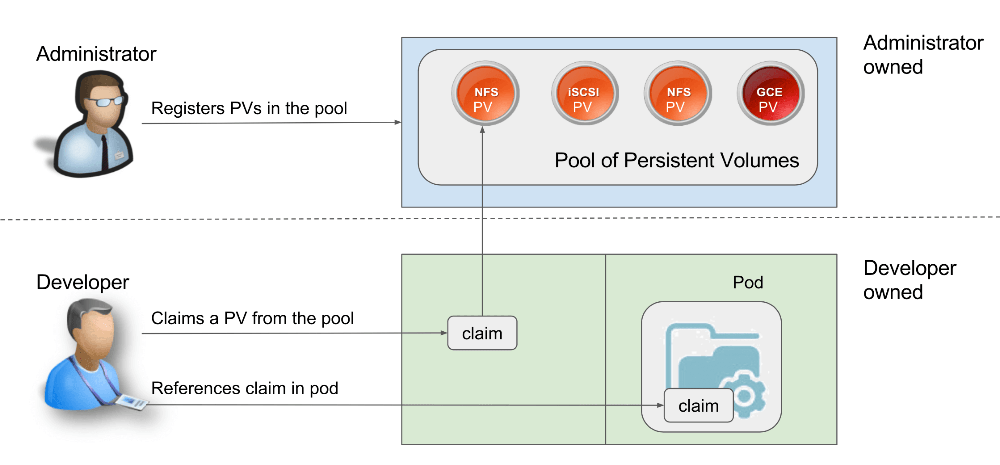

# 06 - Storage

<!-- TOC -->
* [06 - Storage](#06---storage)
  * [Introduction - Storage clasees](#introduction---storage-clasees)
    * [1. File Storage (NAS – Network Attached Storage)](#1-file-storage-nas--network-attached-storage)
    * [2. Block Storage (SAN – Storage Area Network)](#2-block-storage-san--storage-area-network)
    * [3. Object Storage (Cloud-based or On-Prem)](#3-object-storage-cloud-based-or-on-prem)
    * [Summary Table](#summary-table)
  * [Storage in Kubernetes: `PV` and `PVC`](#storage-in-kubernetes-pv-and-pvc)
    * [`PV` lifecycle](#pv-lifecycle)
  * [Static PV provisioning](#static-pv-provisioning)
    * [Access modes](#access-modes)
    * [Reclaim policies](#reclaim-policies)
  * [PV dynamic provisioning](#pv-dynamic-provisioning)
    * [StorageClass and `volumeBindingMode` values](#storageclass-and-volumebindingmode-values)
      * [PVC hot resize](#pvc-hot-resize)
<!-- TOC -->

## Introduction - Storage clasees

### 1. File Storage (NAS – Network Attached Storage)

- **How it works**: Data is stored and accessed as complete **files** (with a hierarchy: folders, directories).
- **Protocol**: Uses file-level protocols like **NFS** (Linux/Unix) or **SMB/CIFS** (Windows).
- **Access**: Over a network – typically seen as a **shared folder**.
- **Management**: Managed **like a local file system** with permissions, file locking, etc.
- **Performance**: Can be slower compared to block storage due to file-system overhead.

**Best for**:

- Shared file access (home directories, office documents)
- File servers
- Media archives

---

### 2. Block Storage (SAN – Storage Area Network)

- **How it works**: Data is stored in **blocks**, like raw hard drives. Each block can be formatted with any file system
  the OS supports.
- **Protocol**: Uses block-level protocols like **iSCSI**, **Fibre Channel**.
- **Access**: Appears to the server as a physical hard drive; requires OS-level formatting.
- **Management**: More granular control over data placement and performance tuning.
- **Performance**: High-speed and low-latency; great for databases and transactional workloads.

**Best for**:

- Databases
- Virtual machine disks
- High-performance applications

---

### 3. Object Storage (Cloud-based or On-Prem)

- **How it works**: Data is stored as **objects** with metadata and a unique identifier, in a flat namespace (no
  folders).
- **Protocol/API**: Accessed via **HTTP-based APIs** (e.g., **S3**, **OpenStack Swift**).
- **Access**: Not mounted like a drive; accessed via apps or services via API.
- **Scalability**: Extremely scalable; ideal for unstructured data.
- **Performance**: Optimized for throughput and durability, not low-latency access.

**Best for**:

- Backup and archival
- Media files, images, videos
- Big data and analytics
- Cloud-native applications

---

### Summary Table

| Feature         | File (NAS)              | Block (SAN)          | Object (Cloud)             |
|-----------------|-------------------------|----------------------|----------------------------|
| Data Unit       | File                    | Block                | Object                     |
| Access Protocol | NFS, SMB                | iSCSI, Fibre Channel | HTTP/S (REST APIs)         |
| File System     | Managed by NAS          | Managed by Host OS   | No traditional file system |
| Performance     | Moderate                | High                 | Scalable, not low-latency  |
| Best Use Cases  | Shared files, user data | Databases, VMs       | Backup, media, web apps    |
| Scalability     | Limited by appliance    | Limited by SAN size  | Virtually unlimited        |


## Storage in Kubernetes: `PV` and `PVC`

Depending on the type of application, the Kubernetes cluster could deal with any of the classes specified above.

For instance, to run a database a block storage (AWS: EBS ElasticBlockStore, GCLOUD: GCEPD
GoogleComputeEnginePersistenceDisk) should be more appropriate.
An object storage might be more suitable for store database backups (S3).

This requires that Kb8 should be able to interact with all those technologies, protocols and vendors,
meaning that a separate custom connector is needed to communicate with all of these.

> Kubernetes creates a common interface to abstract the interaction with the storage and the way it is provided: *
*persistence volumes** and **persistence volume claim**.

All these different types of storage are abstracted as `PersistentVolume` `PV` instances inside the cluster,
usually configured by cluster administrators and contains the vendor specific logic to interact with the storage.

> - A **persistence volume** can be shared among several applications.
> - Represents any piece of storage in cluster.
> - That is persistent: exists beyond the lifecycle of the pod that is using it.

When a workload needs storage can define one or more **volume** of several types.
A **volume** is an abstraction defining a **mount point** in the file system of the container.

A volume needs to be linked to a subpart of a `PV` via a `PersistentVolumeClaim` `PVC`, it is the
way to inform the cluster of a certain storage amount and type that a workload needs.

### `PV` lifecycle

- **Provisioning**: system administrator creates storage chunck that are persistence volumes (block, NFS, distributes)

- **Binding (PVC)**: the developer asks for persistence storage request with PVC, binding to a persistence volume that
  was provisioned in the earlier stage (available in the storage pool). Here the storage amount and the access modes are
  defined. Every time a new PVC is created the master node controls storage pools for a matching PV with the PVC.

- **Using**: Use the claim in a pod as a volume. Once the PVC is submitted to the Kub API, the master node checks if the
  claim has been bound to a persistence volume. If yes, Kubernetes starts the pod using the volume.

- **Reclaiming**: once the user is done with their volume, the PVC can be deleted from Kubernetes which allows a
  reclaiming of the resources allocated

## Static PV provisioning

> With static PV provisioning administrators need to now the developer's needs
> in order to pre-configure PVs fulfilling those requirements

**This approach is very easy to configure but is less flexible**



For instance, the following is a pre-built PV

```yaml
# 1. Persistent Volume (PV)
apiVersion: v1
kind: PersistentVolume
metadata:
  name: mongo-pv
spec:
  capacity:                      #B
    storage: 1Gi                 #B
  accessModes:                   #C
    - ReadWriteOnce                #C
    - ReadOnlyMany                 #C
  #an alternative is 
  #hostPath: 
  #  path: /tmp/mongodb         
  #GCE Persistent Disks
  gcePersistentDisk:             #D
    pdName: mongodb              #D
    fsType: ext4                 #D 
```

### Access modes

| Access Mode     | Abbr. | Description                                                                                                                               |
|-----------------|-------|-------------------------------------------------------------------------------------------------------------------------------------------|
| `ReadWriteOnce` | `RWO` | The volume can be mounted by a single worker node in read/write mode. While it’s mounted to the node, other nodes can’t mount the volume. |
| `ReadOnlyMany`  | `ROX` | The volume can be mounted on multiple worker nodes simultaneously in read-only mode.                                                      |
| `ReadWriteMany` | `RWX` | The volume can be mounted in read/write mode on multiple worker nodes at the same time.                                                   |

### Reclaim policies

| Policy                 | Behavior                                                                                                                                                                                                                                                    |
|------------------------|-------------------------------------------------------------------------------------------------------------------------------------------------------------------------------------------------------------------------------------------------------------|
| `Retain`               | Manual cleanup required. The PV and its data are preserved after the PVC is deleted. You must manually delete the PV and clean up the associated storage (e.g., files or disks). Useful when you want to inspect or back up data before reusing the volume. |
| `Delete`               | Automatic cleanup. The storage resource (like a cloud disk or volume) is automatically deleted along with the PV when the PVC is deleted. Commonly used in dynamic provisioning.                                                                            |
| `Recycle` _deprecated_ | Deprecated. Performs a basic scrub (rm -rf /thevolume/*) and makes the volume available again. Not recommended or supported in most newer Kubernetes versions.                                                                                              |

Developers can then create a PVC referring to the PV

```yaml
# 2. Persistent Volume Claim (PVC)
apiVersion: v1
kind: PersistentVolumeClaim
metadata:
  name: mongo-pvc
spec:
  resources:
    requests:                
      storage: 1Gi           
  accessModes:               
    - ReadWriteOnce          
  #empty string disables dynamic provisioning
  storageClassName: ""       
  volumeName: mongo-pv  # This binds the PVC to the specific PV
```

And then use it in a pod

```yaml
# 3. Pod using the PVC
apiVersion: v1
kind: Pod
metadata:
  name: mongodb
spec:
  volumes:
    - name: mongodb-data              
      persistentVolumeClaim:          
        claimName: mongodb-pvc        
  containers:
    - image: mongo
      name: mongodb
      volumeMounts:                   
        - name: mongodb-data          
          mountPath: /data/db         
```
## PV dynamic provisioning

>With dynamic provisioning, instead of provisioning persistent volumes in advance (and manually), 
> the cluster admin deploys a **persistent volume provisioner** to automate the _just-in-time_ provisioning process, 
> as shown in the following figure.


When a user creates a persistent volume claim, the dynamic provisioner provisions the underlying storage and creates the PersistentVolume object for that particular claim. The two objects are then bound.

If your Kubernetes cluster is managed by a cloud provider, it probably already has a persistent volume provisioner configured. If you are running Kubernetes on-premises, you’ll need to deploy a custom 

### StorageClass and `volumeBindingMode` values

A `StorageClass` object represents a class of storage that can be dynamically provisioned. 
As shown in the following figure, **each storage class specifies what provisioner to use and the parameters that should be passed to it when provisioning the volume**. 
The user decides which storage class to use for each of their persistent volume claims.
The values for `volumeBindingMode` are:

- `WaitForFirstConsumer`: This mode causes the system to wait until the first pod (the consumer of the claim) exists before binding the claim. The volume is only provisioned then and not earlier. Until then it will get status `Pending`
  - This is the case with provisioners that create **node-local volumes**, therefore the node where the pod is scheduled is relevant to determine where the storage must be allocated (same node as the pod) the storage class was `rancher.io/local-path`.
- `Immediate`: self explicative

The PVC specifies the `storageClassName` to use


```yaml
apiVersion: v1
kind: PersistentVolumeClaim
metadata:
  name: mongodb-pvc-nfs
spec:                      
  resources:               
    requests:              
      storage: 1Gi         
  accessModes:             
    - ReadWriteOnce        
  storageClassName: nfs    
```


#### PVC hot resize

In dynamic provisioning, the PVC requested storage can be changed even if it is in use on a workload.
This is driven by the storage class setting `spec.allowVolumeExpansion`
We can do that by changing the value on the yaml file and apply the configuration again in the cluster.
For instance, we could change the value of `mongodb-pvc-nfs` from 1Gb to 10Gb
It is possible that, after changing the config onto the cluster the size does not change.
To descover the reason we can simply describe the PVC

```bash
$ kubectl describe pvc mongodb-pvc-default
...
Conditions:
Type                      Status  ... Message
----                      ------  ... -------
FileSystemResizePending   True        Waiting for user to (re-)start a pod to finish file system resize of volume on node.
```
As explained, after the pod restart the PVC will be resized.


